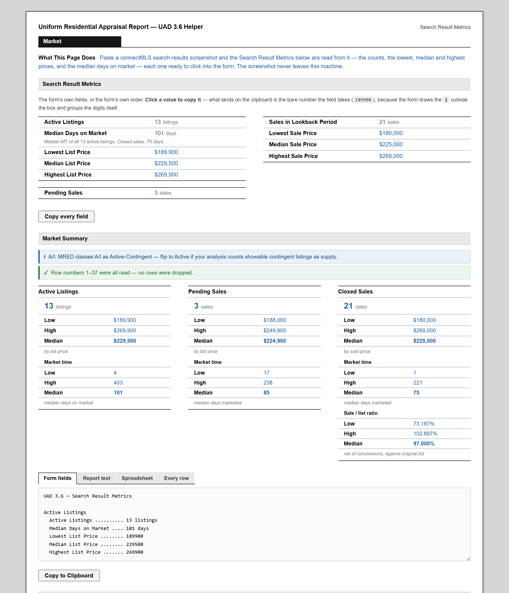

# UAD 3.6 Helper

**▶ [Open the app](https://pairedsales.github.io/UAD-3.6-Helper/)** — nothing to install.

Paste a connectMLS search-results screenshot. Get the UAD 3.6 **Search Result
Metrics** section, field for field, ready to click into the form — active
listings, pending sales and closed sales with their low, high and median
price, the **median days on market**, plus the **sale-to-list ratio** of every
closed sale, net of seller concessions.

Nothing is uploaded. The screenshot is read in your browser, by the same
deterministic template-matching recognizer as its sibling project
[MLS-Extract](https://github.com/PairedSales/MLS-Extract): no OCR engine, no model, no network.



---

## Using it

Open **[pairedsales.github.io/UAD-3.6-Helper](https://pairedsales.github.io/UAD-3.6-Helper/)**,
or clone the repo and double-click `index.html` — no server, no build step, no
browser flags either way.

1. Screenshot your grid, cropped from the header row down — include the
   header row and the **Stat**, **MT**, **Orig List Pr**, **List Price**,
   **Sold Pr** and **CONC** columns.
2. `Ctrl+V` into the page (or click to upload).
3. Click each value straight into the form. Check the review table underneath.

### CoreLogic Matrix

A Matrix results grid reads too — tested against a Cedar Rapids Area
Association of Realtors display. Include the header row and the **St**,
**DOM**, **List Price**, **Orig Price** and **Sold Price** columns, and crop
above the floating *Actions* toolbar (the rows faded behind it are not readable).

- `S`, `A` and `P` are Sold, Active and Pending. `C`, `W`, `X` and `T` are
  recognized so they are never mistaken for those three, but they are counted
  **nowhere until you choose** in the status mapping — `C` is contingent on one
  board and closed or cancelled on another.
- `DOM` is days on market, bound by its header label exactly as `MT` is.
- **Add `List Price` to your Matrix display.** Without it the active and
  pending listings are counted but have no price: `Orig Price` is the price a
  listing was *first* offered at, and it is never used in place of the current one.
- The one-letter status is only read beneath its `St` header. A column of single
  glyphs could be `BR`, and at this size `S` looks like `5`.

### Or drop in an export

A **.csv** or **.tsv** export of the same search works too — drop it on the
page, pick it with the file chooser, or copy the cells out of a spreadsheet and
`Ctrl+V`. An export is *parsed*, not recognized, so there is nothing to misread;
the rules that protect the numbers are the same.

Columns are found by their header text, in whichever MLS's words the export
uses:

| Role | Headings accepted |
|---|---|
| Status | `Stat`, `Status` |
| List price | `List Price`, `Current Price`, `Current List Price` |
| Original list price | `Orig List Pr`, `Orig List Price`, `Original List Price` |
| Sold price | `Sold Pr`, `Sold Price`, `Close Price`, `Closed Price`, `Closed Pr` |
| Concessions | `CONC`, `Concessions`, `Seller Concessions` |
| Market time | `MT`, `Market Time`, `DOM`, `Days on Market` — never `CDOM` |
| MLS number | `MLS #`, `MLS#`, `MLS Number`, `MLS No` |

- A column no heading names is not read. Two columns that claim the same role
  (`List Price` beside `Current Price`) bind **neither**, and the reading is
  provisional until the export is fixed.
- A cell that is not a clean number — `42O,000`, `1,23,456`, a range — is left
  empty and named by line and column, never coerced. An unreadable concession
  blocks copying outright, because empty would count as zero.
- A record with the wrong number of fields has had its values shifted between
  columns, so none of them is used: it is listed with no status, and blocks
  copying until it is set by hand.
- Besides MRED's codes, the single-letter `S` (sold), `A` (active) and `P`
  (pending) that some other MLSs export are understood. Other letters are not
  guessed at — `C` is Closed in one MLS and Contingent in another.
- A blank DOM is known to be blank in a file, so a closed sale entered with no
  marketing period is disclosed ("44 of 46 sales") rather than blocking the
  form. A blank DOM on an **active** listing still blocks: that median is a form
  field.

### The form panel

The first thing on the page after a paste is the form's own section, in the
form's own order and grouping:

```
Active Listings          13           Sales in Lookback Period    21
Median Days on Market   101           Lowest Sale Price     $180,000
Lowest List Price  $189,900           Median Sale Price     $225,000
Median List Price  $229,500           Highest Sale Price    $269,000
Highest List Price $269,900

Pending Sales             3
```

**Click a value to copy it.** What reaches the clipboard is the bare number the
field takes — `189900`, not `$189,900` — because the form draws the `$` outside
the box and groups the digits itself, and a numeric input that refuses
`189,900` while accepting `189900` is far commoner than the reverse.

Two boxes of that section are missing, on purpose. **Lookback Period** is a
parameter of your search rather than a column of the grid, and **Distressed
Market Competition** is a judgement — MRED gives a short sale its own status
code and gives an REO, a relocation or an estate sale none. Nothing in a
screenshot answers either one, so neither appears here: every figure on this
panel is one the app read off your grid.

The paste box moves below the results once there is something to show, so the
numbers are the first thing on the page on every subsequent paste.

### What it computes

| Bucket | Rows | Price used |
|---|---|---|
| Active listings | `ACTV`, `PCHG`, `NEW`, `TEMP`, `RACT`, `BOMK`, `AUCT` | List Price |
| Pending sales | `PEND`, `FIN`, `A/I`, `CTGO`, `SS` | List Price |
| Closed sales | `CLSD` | **Sold Pr** |
| Not counted | `EXP`, `CANC`, `RNTD`, `CTGA`, `HOLD`, … | — |

Days on market for each bucket comes from the **MT** column of the same rows.

`ACTV`, `PCHG`, `TEMP`, `FIN`, `PEND` and `CLSD` are mapped as specified;
the rest follow MRED Rules & Regulations §2.5 and standard appraisal practice.
**Every mapping is editable in the app**, and the cards recalculate as you
change it.

`TEMP` counts as an **active listing**: the listing agreement is in force, it is
not under contract, and it carries a current list price — MRED itself classes it
Active (MC=A). `A/I` is treated as *pending*, because a contract exists at an
agreed price, which matches UAD 3.6's "Contract" status; MRED classes it
Active-Contingent, and one click moves it.

**Median**: the middle value for an odd count, the mean of the two middle values
for an even one, rounded to the dollar. An empty set reports `—`, never `$0`.

**Median days on market** comes from the **MT** (market time) column. The form
prints that box inside its *Active Listings* group, between the count and the
list prices, so the box carries the **active listings'** median — every other
field in that group describes the active set. The pending and closed medians
are read too and shown on their own cards, because what an appraiser compares
the active market time against is how long the sold ones took.

**Sale-to-list ratio**: `(sold price − concessions) ÷ original list price`,
shown to three decimals (`98.859%`). A blank CONC cell counts as no concessions,
and a concession with cents (`9978.71`) is read as such — connectMLS writes
money with thousands separators and concessions with a decimal, and the two are
told apart by where the mark sits, not by its shape.
A closed sale with no original list price gets no ratio — the *current* list
price is not substituted, because a listing reduced twice would report a ratio
against a number nobody ever offered at.

**Ten or fewer closed sales** and each ratio is quoted individually, comp by
comp, alongside the median — with a handful of sales the individual ratios are
the analysis, and a median of six numbers hides more than it summarizes. Comp 1
is the first closed sale on the screenshot, so a number ties back to its row.
Past ten, the median stands alone.

```
Closed sales: 6   Low $180,000   High $199,000   Median $183,200
   Median days on market: 44
   Sale/list ratio, net of concessions: Low 73.187%   High 102.331%   Median 98.500%
   Comp 1:   100.057%
   Comp 2:   89.744%
   Comp 3:   73.187%
   …
```

---

## What it will not do

The whole design principle is that a **wrong number is far worse than a missing
one**. An appraiser can see a gap; they cannot see a plausible mistake.

- A closed sale whose **Sold Pr** could not be read is still counted, but
  contributes nothing to low/high/median, and the card says how many rows the
  prices actually rest on. Its asking price is never substituted.
- A status that does not clear the recognizer's confidence bar is reported as
  unreadable, not filed under the nearest guess. A row whose Stat cell is blank
  is **still a listing** — it appears in the table with no status, waiting for
  you, and is never deleted from the reckoning.
- **Any** unresolved row marks the summary **provisional**: the copy buttons go
  off and the text itself carries a `*** PROVISIONAL ***` header listing what is
  outstanding, so a summary copied by hand still says so. The gate also fires on
  a rejected money column, a discarded row band, a gap in the row numbering, an
  unpriced row, or money columns identified only by position.
- The green "no rows were dropped" tick appears only when the numbering starts
  at 1, has no gaps, nothing was discarded, and every status was read.
- Every glyph of every price goes through the confusable-pair guard
  (`0`/`9`, `3`/`5`, `1`/`7`, …). One ambiguous glyph rejects the whole cell.
- **Days on market is reported only when the header says `MT`.** A money column
  can be found in the data because money has a shape — a dollar sign, thousands
  separators, a plausible magnitude. Market time has none: it is a column of
  one- to three-digit integers, exactly like `# Rms`, `Yr Blt`, `All Beds`,
  `ASF` and `# Garage`. A median days-on-market that is really a median year
  built is a number nobody can see is wrong, so with no `MT` header the field
  reads `—` and the app says why. The value bounds in `config.js` do not help
  here and are not pretending to: every year in a `Yr Blt` column is under the
  3650-day ceiling. The header label is the whole guard.
- A median days on market that would rest on **some** of a bucket's rows marks
  the summary provisional, the same way an unreadable price does — and every
  MT cell is editable in the review table, so typing the two digits off the
  screenshot clears it.
- The per-field copy buttons go off with everything else while a reading is
  provisional. A bare number has nowhere to carry a caveat, and the text block
  — which does carry one — stays selectable by hand.
- If the grid numbers its rows, those numbers are read back as an independent
  check that nothing was dropped, and any gap is reported by row number.

---

## How it reads the image

The recognizer knows what connectMLS looks like. It is not general OCR.

It also does what MLS-Extract does about **speed**. MLS-Extract feels instant
because you hand it one hand-cropped column; run its own code over a full
23-column grid and it costs a second of preprocessing, same as anything else.
So the work is split the same way it splits it — locate, crop, then read:

- a **locate pass at source resolution**, which only has to find where the rows
  and columns are (1.5 megapixels, not 24);
- a short list of **columns worth reading**, from the header where there is one;
- those columns **cut out, laid side by side and upscaled 4×** — the original
  grid with the irrelevant columns deleted, which every stage below then reads
  at full fidelity.

On the reference grid that is 7 columns of 23, 6.8 megapixels instead of 24.2,
and about a second from paste to summary.

1. **Preprocess** — upscale 4×, flatten alternating-row and selection shading,
   Otsu threshold, erase table rules. (Ported verbatim from MLS-Extract.)
2. **Rows** — horizontal projection. Bands cut by the screenshot edge are
   detected and excluded by name.
3. **Tokens** — each row is split into runs of ink at a gap derived from the
   screenshot's own glyph width, so the same code works at 100% zoom and on a
   2× Retina paste.
4. **Columns** — tokens are grouped across rows by horizontal overlap, not by
   gutter width. `Orig List Pr` and `List Price` sit a few pixels apart, closer
   than any gutter threshold can separate, but their cells never overlap.
5. **Header** — each header cell is matched as a *whole word* against the known
   connectMLS labels, in whichever of five UI font families fits best.
6. **Status** — the `Stat` cell is matched as a whole token against the closed
   MRED vocabulary. Cells are then clustered by shape and ink colour and
   labelled once per cluster, so twenty-one `CLSD` cells are one twenty-one-vote
   decision rather than twenty-one coin flips. The contingency codes MRED
   prints with the kick-out hours appended — `HS48`, `HC24` — have no fixed
   rendering to match, so a refused cell gets one more try split in two: the
   letters read glyph by glyph, the suffix only proving it is digits. They are
   reported as `HS` and `HC`; the hours change no bucket and are not printed.
7. **Prices** — read glyph-by-glyph against a bank built from real connectMLS
   pixels. Whether a column carries a leading `$` is decided for the whole
   column at once: at 11px the dollar sign loses its stem to binarization and
   correlates as `5`, `8` or `S`, but the comma grouping has to add up, and
   every cell in the column votes on it.
8. **Market time** — the `MT` column, read as plain integers. Bound by its
   header label and by nothing else: see "What it will not do" above.
9. **Roles** — `Stat`, `List Price`, `Orig List Pr`, `Sold Pr` and `CONC` are
   named from the header where there is one. Failing that, the sold column is
   the money column populated on the closed rows **and blank on the rest** —
   agreement alone is not evidence, because on a closed-heavy grid an
   always-filled asking-price column agrees with the closed set simply because
   almost every row is closed. Cross-checks can still overturn the result:
   `Orig ≥ List` on most rows, `median(sold)` within half to one-and-a-half
   times `median(list)`. Each role records **how** it was decided, and the
   reported confidence is that of the weakest role that feeds a number.

---

## Development

```bash
npm install          # puppeteer + node-canvas, for the tests only
npm run fixture:all  # regenerate every fixture PNG and its ground truth
npm run build:assets # re-inline assets/*.png into src/assets.js
npm test             # fixtures, statistics, reference grid, edge cases
```

| Script | What it does |
|---|---|
| `npm test` | Everything, in order |
| `npm run test:stats` | Arithmetic only — no browser, ~1s |
| `npm run test:table` | The CSV / TSV reader — no browser, ~1s |
| `npm run test:files` | Exports dropped on the real page |
| `npm run test:grid` | The 37-row reference grid, asserted row by row |
| `npm run test:edge` | The awkward connectMLS inputs (below) |
| `npm run test:matrix` | The CoreLogic Matrix fixtures, asserted row by row |
| `npm run build:assets` | Re-inline `assets/*.png` into `src/assets.js` |

### Fixtures

The user's original screenshot is not a file we have, so `tests/grid-data.js`
holds its 37 rows transcribed, and `tests/make-grid-fixture.js` re-renders them
at connectMLS's real geometry — 11px text on a 27px pitch, bold colour-coded
status codes, alternating shading, a header with a sort arrow. Ground truth is
computed from the same table and written next to each PNG, so a fixture and its
expected numbers cannot drift apart.

| Fixture | What it proves |
|---|---|
| `grid` | Every status, price, concession and ratio, row by row |
| `grid-no-header` | Columns inferred from the data alone |
| `grid-no-closed` | No sold column is bound when there are no closed sales |
| `grid-all-closed` | Active and pending report zero, not null noise |
| `grid-selected` | A highlighted row changes nothing |
| `grid-grayscale` | Clustering falls back to shape when colour is gone |
| `grid-verdana` | The UI font is detected, not assumed |
| `grid-narrow` | A crop with no `Orig List Pr` — ratios absent and *said so* |
| `grid-hidpi` | A 2× Retina paste gives identical buckets |
| `grid-clipped-top` / `-bottom` | A sliced row is excluded, not misread |
| `grid-blank-stat` | A blank Stat cell keeps its listing, and blocks the copy |
| `grid-blank-mt` | One active listing with no MT — the median says what it rests on |
| `grid-kickout` | `HS48` / `HC24` / `HS120` read, and bucket as `HS` / `HC` |
| `grid-few-closed` / `-eleven-closed` | The comp list appears at 10 and not at 11 |
| `grid-wide-range` | Prices from $87k to $2.1M |
| `matrix` | A Matrix grid (Verdana, one-letter status, DOM, underlined ML #) with no List Price — actives counted, never priced from Orig Price |
| `matrix-list-price` | The same grid with List Price — a complete, copyable reading, every row asserted |
| `matrix-hidpi` | A 2× Retina Matrix paste gives identical results |
| `matrix-no-header` | No header: the one-letter status is refused, and no data row is taken for a header |

### Layout

```
index.html            markup
styles.css            MLS-Extract's design tokens, plus this app's components
app.js                UI: state, rendering, the editable review table
src/
  config.js           every threshold, and why it has that value
  vocab.js            MRED status codes and connectMLS header labels
  assets.js           reference glyph images, inlined as data URIs
  imaging.js  ┐
  segment.js  ├─ ported verbatim from MLS-Extract — do not tune here
  glyph.js    │
  rules.js    ┘
  templates.js        the digit bank, and its font-adapted fallback
  word.js             whole-word template matching
  price.js            prices, concessions, and pitch-aware re-segmentation
  grid.js             tokens → columns → named roles
  status.js           the Stat column: clustering and constrained decoding
  stats.js            buckets, medians, ratios, output formats (pure, testable)
  table.js            CSV / TSV exports: split, bind by header, parse (pure, testable)
  pipeline.js         the run, and everything it refuses to do quietly
  debug.js            the recognition-detail panel
tests/                fixtures, generators and suites
```

`src/imaging.js`, `src/segment.js`, `src/glyph.js` and `src/rules.js` are byte-
for-byte copies of MLS-Extract's calibrated routines. They are shared, not
forked: fix a bug in one project and port it to the other rather than tuning
locally.
